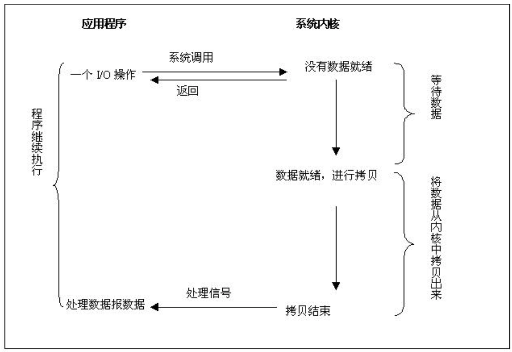

# Event-Loop（事件轮询）

## 快速导航

- [线程模型](#线程模型)
- [EventLoop](#EventLoop)
- [操作系统I/O模型及轮询技术演变](#操作系统的轮询技术演进)
    - [同步阻塞I/O](#同步阻塞IO)
    - [同步非阻塞I/O](#同步非阻塞IO)
    - [I/O多路复用（Select、poll、epoll、kqueue）](#IO多路复用)
    - [信号驱动I/O](#信号驱动IO)
    - [异步I/O模型](#异步IO模型)
    - [白话风格（小明与妹子的邂逅）](#白话风格)
- [Node.js中的Event Loop](#Node.js中的EventLoop)
- [浏览器中的Event Loop](#浏览器中的EventLoop)

## 面试指南

* ``` I/O多路复用轮询技术select和epoll的区别？ ```，参考：[#](#select和epoll的区别)

## 线程模型

> **为什么是单线程?**

javascript是单线程的，此时是否有疑问为什么是单线程呢？多线程处理效率不是更高吗？需要从浏览器说起，在浏览器环境中对于DOM的操作，试想如果多个线程来对同一个DOM操作是不是就乱了呢，那也就意味着对于DOM的操作只能是单线程，避免DOM渲染冲突。另外，在浏览器环境中UI渲染线程和JS执行引擎是互斥的，一方在执行时都会导致另一方被挂起，这是由JS引擎所决定的。

> **单线程模式下为何如此高效？**

上面说了既然javascript是单线程的，那么同一时间只能处理一件事情，对于高并发大量请求不是会造成程序阻塞吗？答案是no，不会造成程序阻塞的解决方案是 **`异步非阻塞`**，异步的具体实现就是今天要讲的重点 **`Event-Loop`** 另外，单线程也避免了线程切换对资源的浪费。

## EventLoop

> ***什么是EventLoop？***

EventLoop是Javascript对异步的具体实现，在程序执行过程中，直接执行同步代码，异步代码／函数会先放在异步队列中挂起，待同步的任务执行完成之后，轮询执行异步队列中的任务。

> ***为什么要进行事件轮询？***

可能经常会听到一个词Node.js是异步非阻塞的，但你真正了解吗？在异步非阻塞I／O调用中，用户发起一个I/O操作后会立即返回（`优处是CPU时间片可以用来处理其它事物，体现了异步非阻塞`），此时返回的只是调用的状态，待完整的I/O完成之后，应用程序通过回调接收通知（`javascript同学熟知的Callback`），在应用程序接收回调通知之前的这段时间里，会有一种判断来确认I/O操作是否完成，这种判断技术就是轮询。

## 操作系统的轮询技术演进

> 本来是想要介绍Node.js的轮询技术，但是在这之前先了解下操作系统I/O模式的演进，有助于之后的一些理解，操作系统对于I/O的处理通常是有两步
* 应用程序先发起系统调用待数据就绪
* 将数据从内核缓冲区拷贝到应用缓冲区

#### 同步阻塞IO

从应用程序开始系统调用->数据就绪，进行拷贝->拷贝结束，这之间应用程序都处于等待状态，不能做其它事情，直到将数据拷贝到用户空间或出错才返回，我们称之为阻塞I/O模式。


#### 同步非阻塞IO

相比于同步阻塞I/O模式，同步非阻塞I/O在每次调用之后，如果数据没有就绪就会立即返回，之后重复调用来检查I/O操作是否就绪，这对CPU资源是一个极其浪费的操作，直到数据就绪将数据从内核拷贝到用户空间，返回成功指示给到应用程序。

Read：就是一种实现，通过重复轮询I/O来判断。


#### IO多路复用

链接（Socket）并发大的情况，上面两种就不适合了，前面一个处理不完，后面就只能干等，这里就用到了I/O多路复用，下图所示相比较前两种，分为了两步，先进行select数据就绪后，在调用recvfrom进行真正的I/O读写操作。它的高级之处还在于能够一个线程同时处理多个Socket。


I/O多路服用有多种实现模式：`select`、`poll`、`epoll`、`kqueue`

- **select**

通过轮询检查在文件描述符上设置的标识位来进行判断，Select的轮询相当于在数据库中查找一条记录没有建立索引，对所有的Socket进行全部遍历，这对CPU是浪费的。另外Select还有一个限制，对于单个进程所能打开的文件描述符最大只能是1024，那么基于Select的轮询技术最多也只能很好的处理1000并发的吞吐量，可以查看[上一个10年，著名的C10K并发连接问题](http://www.52im.net/thread-566-1-1.html)

- **poll**

poll和select在实现上没有本质的区别，相比较select，poll基于链表来实现，没有了最大链接1024的限制。但是当文件描述符多了之后，每次调用都会对链接进行线性遍历，性能还是十分低下的。

- **epoll**

是linux下效率最高的I/O事件通知机制，没有最大链接限制，通过callbak回调通知机制，不在是每次调用都对链接进行线性遍历，这样就不会随着文件描述符的增加导致效率下降。

在1GB内存的机器上能监听大约10万个端口，远超过select的1024限制，具体可以在服务器上查看`cat /proc/sys/fs/file-max`

- **kqueue**

与epoll类似，仅存于FreeBSD（一种类UNIX操作系统）。

#### 信号驱动IO

仅在Unix上支持，与I/O多路复用相比避免了select的阻塞轮询。应用程序进行系统调用后立即返回，处理其它事物，在数据就绪之后系统会发送一个SIGIO信号到应用程序，应用进程开始读取数据。


#### 异步IO模型

异步I/O模型是目前最理想的一种形式，应用程序发起系统调用后无需等待直接返回当前调用状态，进行后续的其它任务，结果由内核完成I/O操作之后通过回调通知到我们的应用程序，中间没有阻塞过程。

在Linux2.6之后增加了异步I/O的实现方式 **`AIO`**，但是很少系统能够实现。



#### select和epoll的区别

> 如果问到轮询技术的实现一般也会考察select和epoll的区别
- 在操作方式上select采用了线性遍历来查找，链接多了之后可以想象一下在一个诺大的数组中每次通过遍历来锁定一个链接，是多么的消耗性能。epoll则不需要遍历，采用的是回调机制，可以看作一个HashTable，来锁定一个对象是很快的。对于文件描述符（最大连接数）select限制为1024，epoll则没有这个限制，通常在1G内存的机器上所能支持的连接数为10W左右。
- 操作系统支持上来看，目前流行的高性能Web服务器Nginx是基于epoll来实现高并发，当然如果你的链接很小的情况下区别还是不大的select也能满足，如果是大流量、高并发情况epoll目前还是首选模型。

#### 白话风格

> 白话风格（小明与妹子的邂逅）讲解操作系统I/O模型及轮询技术演变

**`故事标题`**：小明与妹子的邂逅  
**`情节介绍`**：小明在校园一次文艺晚会上邂逅了一位妹子，在只得知妹子名字、手机号的情况下，经过几天的苦苦追寻，历经千山万水，终得美人归！  
**`演员介绍`**：男一号@小明、女一号@妹子、串场@门卫大爷  

1. **同步阻塞I/O模式**

小明电话相约妹子在校门口，然后小明很专一、不见到妹子不回家，期间没有做任何事情，一直在等待！

2. **同步非阻塞I/O模式**

小明电话相约妹子在校门口，妹子还没准备好（出门前化妆几小时。。。），这时候的小明很执着，每隔一会儿给妹子发个信息直到妹子准备好了。

3. **I/O多路复用模式**
    1. ***select***
    小明电话相约妹子在校门口，委托门卫select大爷帮忙，select大爷很敬业每出去一个人都会进行询问，但是select大爷有个限制最多只能询问1024个。
    2. ***poll***
    poll类似于select功能，不同的是poll大爷没有1024限制，可以一直坚持，但是当poll大爷超过1024，询问的越来越多之后就显得越来越精疲力尽了。
    3. ***epoll***
    小明电话相约妹子在校门口，委托门卫epoll大爷帮忙，epoll大爷不在是每个询问，规定每个人出入校门必须带上学生证，这样opoll大爷就是知道哪个是小明的女神了，epoll大爷找到女神之后在电话通知小明。

4. **信号驱动I/O模式**

小明电话相约妹子在校门口，此时妹子回复说我还没准备好（出门前化妆几小时。。。），这个时候小明也没去，而是先去干其它事情了，等妹子准备好之后电话通知小明，我已经准备好了，小明这个时候才去校门口等着和妹子的约会。

5. **异步I/O模式**

小明告诉妹子我们在校园门口相约，之后小明没有在那干等了，而是先回宿舍休息会或者和朋友在打会球等等，妹子到校门口之后电话通知小明，我已经来啦。

## Node.js中的EventLoop

在Node.js启动的时候，它会初始化EventLoop，处理程序代码，可能是调用异步API、定时器或者调用process.nextTick()，然后开始事件轮询。

```txt
   ┌───────────────────────┐
┌─>│        timers         │
│  └──────────┬────────────┘
│  ┌──────────┴────────────┐
│  │     I/O callbacks     │
│  └──────────┬────────────┘
│  ┌──────────┴────────────┐
│  │     idle, prepare     │
│  └──────────┬────────────┘      ┌───────────────┐
│  ┌──────────┴────────────┐      │   incoming:   │
│  │         poll          │<─────┤  connections, │
│  └──────────┬────────────┘      │   data, etc.  │
│  ┌──────────┴────────────┐      └───────────────┘
│  │        check          │
│  └──────────┬────────────┘
│  ┌──────────┴────────────┐
└──┤    close callbacks    │
   └───────────────────────┘
```

```!
note: 以上每个方框被称为EventLoop的一个"阶段"
```

#### 阶段概述

* timers: this phase executes callbacks scheduled by setTimeout() and setInterval().
I/O callbacks: executes almost all callbacks with the exception of close callbacks, the ones scheduled by timers, and setImmediate().
idle, prepare: only used internally.
poll: retrieve new I/O events; node will block here when appropriate.
check: setImmediate() callbacks are invoked here.
close callbacks: e.g. socket.on('close', ...).

## 浏览器中的EventLoop

```js
// todo:
```

#### 参考指南

* [The Node.js Event Loop, Timers, and process.nextTick()](https://github.com/nodejs/node/blob/v6.x/doc/topics/event-loop-timers-and-nexttick.md)
* [Node.js Event Loop 的理解 Timers，process.nextTick()](https://cnodejs.org/topic/57d68794cb6f605d360105bf)
* [什么是浏览器的事件循环（Event Loop）](https://segmentfault.com/a/1190000010622146)
* [使用异步 I/O 大大提高应用程序的性能](https://www.ibm.com/developerworks/cn/linux/l-async/)
* [UNIX网络编程](https://book.douban.com/subject/1500149/)
* [Linux网络编程](https://book.douban.com/subject/4189500/)
