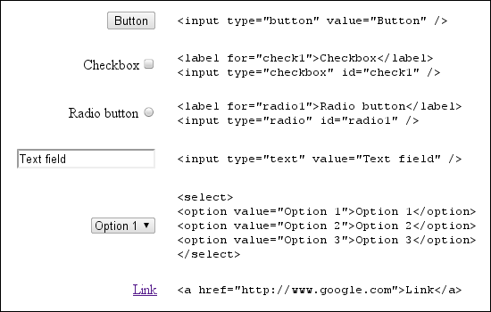

## 辅助功能（a11y）

扩展使用者能够根据个人的能力和偏好创建理想的浏览体验。 扩展程序应包括可访问性组件，该组件通过使视力障碍，听力受损，肢体受限和其他残障人士能够访问扩展程序，从而鼓励包容性用户群。

每个人，不仅是有特殊需求的用户，都可以从辅助功能中受益。 视力障碍，肢体受限用户都将从键盘快捷键中受益。 字幕和笔录对聋哑用户至关重要，但也对语言学习者有所帮助。

人们可以通过多种方式与扩展互动。一些用户具有标准的显示器，键盘和鼠标-或依赖于屏幕放大器和屏幕阅读器。虽然无法预测人们将使用哪些工具来访问扩展，但是任何开发人员都可以采取一些步骤来使扩展尽可能地易于访问。

### 集成可访问的 UI 控件

如果用户无法访问用户界面控件，则无法使用扩展程序。创建可访问 UI 的最简单方法是使用标准 HTML 控件。

> 注意：如果扩展需要自定义控件，那么使自定义控件从一开始就可访问比以后再添加辅助要容易得多。

#### 标准控件

尽可能使用标准的 [HTML UI](https://developer.mozilla.org/en-US/docs/Learn/Accessibility/HTML) 控件。 标准 HTML控件可通过键盘访问，易于缩放，并且屏幕阅读器通常可以解析。




#### 自定义控件中的 WAI-ARIA
[Web Accessibility Initiative - Accessible Rich Internet Applications](https://www.w3.org/WAI/standards-guidelines/aria/) WAI-ARIA 是一种规范，用于使 UI 控件可以通过标准的 DOM 属性集浏览。这些属性向显示器提供有关网页上控件的功能和当前状态的信息。

为了向自定义控件添加 WAI-ARIA 支持，扩展程序的 DOM 元素需要进行修改，以包含 Chrome 在用户交互过程中用于触发事件的属性。屏幕阅读器响应这些事件并描述控件的功能。WAI-ARIA 指定的D OM 属性分为[roles](https://www.w3.org/TR/wai-aria/#roles)，[states 和 properties](https://www.w3.org/TR/wai-aria/#states_and_properties)。

``` html
<div role="toolbar">
```

[aria-activedescendant](https://www.w3.org/WAI/PF/aria/states_and_properties#aria-activedescendant) 属性指定工具栏获得焦点时哪个子项获得焦点。 代码 tabindex ="0" 指定工具栏按文档顺序获得焦点。

考虑以下示例工具栏的完整规范：

``` html
<div role="toolbar" tabindex="0" aria-activedescendant="button1">
  
  
  
</div>
```

将 WAI-ARIA roles，states 和 properties 添加到控件的 DOM 后，Google Chrome 就会向显示器触发适当的事件。由于 WAI-ARIA 支持仍在进行中，因此 Google Chrome 可能不会为每个WAI-ARIA 属性触发一个事件，并且显示器可能无法识别所有触发的事件。

有关将 WAI-ARIA 控件添加到自定义控件的教程，请参阅 [WWW2010 中 Dave Raggett 的演示](https://www.w3.org/2010/Talks/www2010-dsr-diy-aria/)。

#### 专注于自定义控件

对于不使用鼠标浏览网络的用户来说，键盘焦点是必不可少的。 确保操作和导航控件（例如按钮，列表框和菜单栏）可以接收键盘焦点。

默认情况下，HTML DOM 中可以接收键盘焦点的唯一元素是锚点，按钮和表单控件。 但是，将 HTML 属性 tabIndex 设置为 0 会将 DOM 元素置于默认的标签序列中，从而使它们能够获得键盘焦点。

``` html
element.tabIndex = 0
```
``` html
element.focus();

```

设置 tabIndex=-1 将从制表符序列中删除该元素，但仍允许该元素以程序方式接收键盘焦点。

### 支持键盘访问

扩展应该只用键盘也能使用，从而使不能使用鼠标的用户和根本不使用鼠标的用户能够访问它们。

#### 访问

检查用户是否可以在不使用鼠标的情况下在扩展的不同部分之间访问。检查是否可以使用键盘访问弹出窗口。使用 Chrome 键盘快捷键确定扩展是否可访问。

确保界面的哪些部分具有键盘焦点。通常，焦点轮廓会在界面周围移动，但是，如果 CSS 使用过多，则轮廓可能会被抑制或对比度降低。


#### 快捷键

尽管最常见的键盘访问策略是使用 Tab 键在扩展程序的界面上循环焦点，但这并不总是最简单或最有效的选择。

一个简单的 JavaScript 键盘处理程序可能如下所示。注意如何响应用户输入来更新 WAI-ARIA 属性 aria-activedescendant 以反映当前激活的工具栏按钮。

``` js
function optionKeyEvent(event) {
  var tb = event.target;
  var buttonid;

  ENTER_KEYCODE = 13;
  RIGHT_KEYCODE = 39;
  LEFT_KEYCODE = 37;
  // Partial sample code for processing arrow keys.
  if (event.type == "keydown") {
    // Implement circular keyboard navigation within the toolbar buttons
    if (event.keyCode == ENTER_KEYCODE) {
      ExecuteButtonAction(getCurrentButtonID());
      // getCurrentButtonID defined elsewhere 
    } else if (event.keyCode == event.RIGHT_KEYCODE) {
      // Change the active toolbar button to the one to the right (circular).
      var buttonid = getNextButtonID();
      // getNextButtonID defined elsewhere 
      tb.setAttribute("aria-activedescendant", buttonid);
    } else if (event.keyCode == event.LEFT_KEYCODE) {
      // Change the active toolbar button to the one to the left (circular).
      var buttonid = getPrevButtonID();
      // getPrevButtonID defined elsewhere 
      tb.setAttribute("aria-activedescendant", buttonid);
    } else {
      return true;
    }
    return false;
  }
}
```

``` html
<div role="toolbar" tabindex="0" aria-activedescendant="button1" id="tb1"
     onkeydown="return optionKeyEvent(event);"
     onkeypress="return optionKeyEvent(event);">
  
  
  
</div>
```

扩展可以为重要的扩展 UI 元素创建显式的键盘快捷键。要实现这些快捷方式，请将键盘事件监听器连接到控件。在选项页面中提供快捷方式，使用户意识到可用的快捷方式。

### 提供无障碍内容

提供无障碍内容对所有用户都很重要。以下许多准则听起来很熟悉，因为它们反映了所有 Web 内容的良好做法。

#### 文本
字体的选​​择和文本大小会影响扩展内容的可读性。视力不佳的用户可能需要增加扩展文字的大小。如果使用键盘快捷键，请确保它们不会干扰 Chrome 内置的缩放快捷键。

作为扩展 UI 灵活性的指标，请应用 200％ 测试；如果文本大小或页面缩放增加200％，是否仍然可用？

避免将文本嵌入到图像中。用户无法修改大小，显示器无法解释图像。相反，请选择样式化的 Web 字体，例如在 [Google Font API](https://developers.google.com/fonts/) 中找到一种字体。Web 字体可以缩放为不同大小，并且用户可以使用显示器进行查看。

#### 色彩
扩展中背景颜色和文本颜色之间应该有足够的对比度。使用[对比度检查工具](https://snook.ca/technical/colour_contrast/colour.html)测试背景色和前景色是否提供适当的对比度。

在评估对比度时，确保能清晰地看到依赖于图形传达信息的扩展的每个部分。对于特定的图像，可以使用诸如 [Coblis —色盲模拟器](http://www.color-blindness.com/coblis-color-blindness-simulator/) 之类的工具查看各种形式的颜色下的图像的外观。

考虑提供不同的颜色主题，或赋予用户自定义颜色方案的能力，以创建更好的对比度。

#### 声音
如果扩展依靠声音或视频来传达信息，请确保提供字幕或解说词。有关字幕的更多信息，请参见[描述和字幕媒体程序指南](https://dcmp.org/learn/213)。

#### 图片
提供图像的替代文本 (alt)。

``` html
  
``` 

使用替代文本来说明图像的用途，而不是图像内容的文字描述。间隔图像或纯装饰图像应具有空白的 “”替代文字(alt)，或者应完全从 HTML 中删除并放置在CSS中。

如果扩展必须在图像中使用文本，请将图像文本包含在替代文本中。一个很好的参考资源是有关[适当替代文本的WebAIM](https://webaim.org/techniques/alttext/) 文章。


-------


