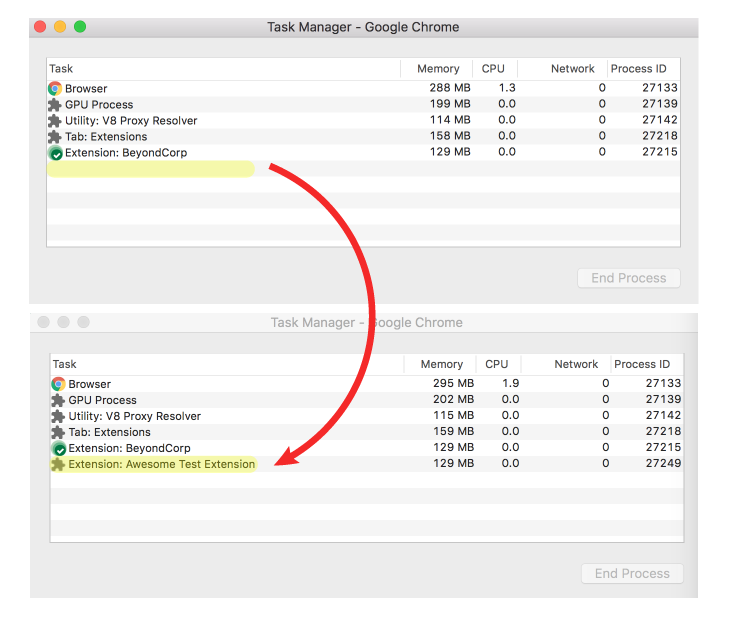

## 使用后台脚本管理事件

扩展程序是基于事件的程序，用于修改或增强 Chrome 浏览器的体验。事件是浏览器触发器，例如，访问到新页面，删除书签或关闭选项卡。扩展程序在其后台脚本中监视这些事件，然后按照指定的指示进行响应。

后台页面在需要时被加载，而在空闲时被卸载。事件的一些示例包括：

* 该扩展程序首次安装或更新为新版本。
* 后台页面正在监听事件，并且已调度该事件。
* 内容脚本或其他扩展[发送消息](https://developer.chrome.com/extensions/messaging)。
* 扩展中的另一个视图（例如弹出窗口）调用 [runtime.getBackgroundPage](https://developer.chrome.com/extensions/runtime#method-getBackgroundPage)。

加载完成后，只要执行某项操作（例如调用 Chrome API 或发出网络请求），后台页面就会保持运行状态。此外，在关闭所有可见视图和所有消息端口之前，后台页面不会卸载。请注意，打开视图不会导致事件页面加载，只会阻止事件页面在加载后关闭。

有效的后台脚本将始终保持休眠状态，直到监听到事件，对指定指令做出反应然后卸载为止。


### 注册后台脚本

后台脚本在 manifest 中的 “background” 字段下注册。它们在 “scripts” 之后的数组中列出，并且 “persistent” 应指定为false。

```
{
  "name": "Awesome Test Extension",
  ...
  "background": {
    "scripts": ["background.js"],
    "persistent": false
  },
  ...
}
```

可以注册多个后台脚本以获取模块化代码。

```
 {
     "name": "Awesome Test Extension",
     ...
     "background": {
       "scripts": [
         "backgroundContextMenus.js",
         "backgroundOmniBox.js",
         "backgroundOauth.js"
       ],
       "persistent": false
     },
     ...
   }
```

> 扩展程序使用 [chrome.webRequest](https://developer.chrome.com/webRequest) API 阻止或修改网络请求的唯一方法是始终使后台脚本保持活动状态。 webRequest API 与非持久性后台页面不兼容。

如果扩展当前使用持久性后台页面，请参阅“[后台迁移指南](https://developer.chrome.com/background_migration)”以获取有关如何切换到非持久性模型的说明。

### 初始化扩展

监听 [runtime.onInstalled](https://developer.chrome.com/extensions/runtime#event-onInstalled) 事件以在安装时初始化扩展。使用此事件可以设置状态或进行一次初始化，例如[上下文菜单](https://developer.chrome.com/extensions/contextMenus)。

``` js
chrome.runtime.onInstalled.addListener(function() {
    chrome.contextMenus.create({
      "id": "sampleContextMenu",
      "title": "Sample Context Menu",
      "contexts": ["selection"]
    });
  });
```

### 设置监听器

围绕扩展依赖的事件构建后台脚本。定义功能上相关的事件可使后台脚本处于休眠状态，直到这些事件被触发，并防止扩展错过重要的触发器。

监听器必须从页面刚开始时同步注册。

``` js
  chrome.runtime.onInstalled.addListener(function() {
    chrome.contextMenus.create({
      "id": "sampleContextMenu",
      "title": "Sample Context Menu",
      "contexts": ["selection"]
    });
  });

  // This will run when a bookmark is created.
  chrome.bookmarks.onCreated.addListener(function() {
    // do something
  });
```

不要异步注册侦听器，因为它们不会被正确触发。

``` js
chrome.runtime.onInstalled.addListener(function() {
    // ERROR! Events must be registered synchronously from the start of
    // the page.
    chrome.bookmarks.onCreated.addListener(function() {
      // do something
    });
  });
```

扩展可以通过调用 removeListener 从其后台脚本中删除监听器。如果事件的所有监听器都被删除，Chrome 将不再为该事件加载扩展程序的后台脚本。

### 过滤事件

使用支持 [event filters](https://developer.chrome.com/extensions/events#filtered) 的 API 将监听器限制在扩展关心的范围下。如果扩展正在监听 [tabs.onUpdated](https://developer.chrome.com/extensions/extensions/tabs#event-onUpdated) 事件，请尝试将 [webNavigation.onCompleted](https://developer.chrome.com/extensions/webNavigation#event-onCompleted) 事件与过滤器一起使用，因为 tabs API 不支持过滤器。

``` js
chrome.webNavigation.onCompleted.addListener(function() {
      alert("This is my favorite website!");
  }, {url: [{urlMatches : 'https://www.google.com/'}]});
```

### 响应监听器

一旦事件触发，监听器就会触发功能。要对事件做出响应，请在监听器事件内部构造所需的响应逻辑。

``` js
  chrome.runtime.onMessage.addListener(function(message, callback) {
    if (message.data == “setAlarm”) {
      chrome.alarms.create({delayInMinutes: 5})
    } else if (message.data == “runLogic”) {
      chrome.tabs.executeScript({file: 'logic.js'});
    } else if (message.data == “changeColor”) {
      chrome.tabs.executeScript(
          {code: 'document.body.style.backgroundColor="orange"'});
    };
  });
```

### 卸载后台脚本

数据应定期保存，以免扩展在未接收 onSuspend 的情况下崩溃而丢失重要信息。使用 Storage API 可以帮助完成此任务。

``` js
 chrome.storage.local.set({variable: variableInformation});
```

如果扩展使用[消息传递](https://developer.chrome.com/extensions/messaging)，请确保所有端口均已关闭。 在关闭所有消息端口之前，后台脚本不会卸载。监听 [runtime.Port.onDisconnect](https://developer.chrome.com/extensions/runtime#property-Port-onDisconnect) 事件将洞悉打开的端口何时关闭。使用 [runtime.Port.disconnect](https://developer.chrome.com/extensions/runtime#property-Port-disconnect) 手动关闭它们。

``` js
 chrome.runtime.onMessage.addListener(function(message, callback) {
    if (message == 'hello') {
      sendResponse({greeting: 'welcome!'})
    } else if (message == 'goodbye') {
      chrome.runtime.Port.disconnect();
    }
  });
```

通过监视扩展的条目何时从 Chrome 的任务管理器中出现和消失，可以观察到后台脚本的寿命。




单击 Chrome 菜单，将鼠标悬停在更多工具上，然后选择 “任务管理器”，以打开任务管理器。

几秒钟不活动后，后台脚本会自行卸载。如果需要最后一分钟的清理，请监听 [runtime.onSuspend](https://developer.chrome.com/extensions/runtime#event-onSuspend) 事件。

``` js
chrome.runtime.onSuspend.addListener(function() {
    console.log("Unloading.");
    chrome.browserAction.setBadgeText({text: ""});
  });
```

但是，与依赖 runtime.onSuspend 相比，应首选持久化数据。它不需要进行尽可能多的清理，并且在崩溃时没有影响。


-------

