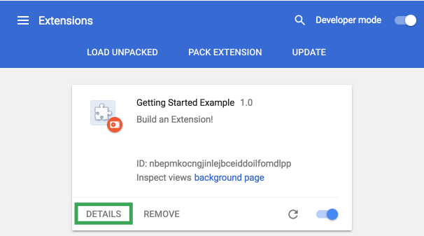

## 入门教程

扩展由不同但相互联系的组件组成。组件可以包括 [后台脚本](./background_content.md)，[内容脚本](./content_scripts.md)，[选项页](./options.md)，[交互页面](./user_interface.md)和各种逻辑文件。扩展组件是使用 Web 开发技术创建的：HTML，CSS 和 JavaScript。扩展的组件各有其功能，并且是可选的。

本教程将构建一个扩展，允许用户更改 developer.chrome.com 上任何页面的背景颜色。 我们将使用许多核心组件来介绍它们之间的关系。

首先，创建一个新目录来保存扩展名的文件。

完整的扩展程序可以在[此处](/get_started_complete.zip)下载。

### 创建 Manifest

扩展始于 [manifest](./manifest.md)，我们先创建一个 manifest.json 文件，包含如下代码。

```
 {
    "name": "Getting Started Example",
    "version": "1.0",
    "description": "Build an Extension!",
    "manifest_version": 2
  }
```

包含 manifest 文件的目录可在开发人员模式下以其当前状态添加为扩展。

1. 在浏览器地址栏中输入 chrome://extensions, 打开**扩展管理**页面。

    * 也可以通过单击 Chrome 菜单，将鼠标悬停在**更多工具**上，然后选择**扩展程序**来打开**扩展程序管理**页面。
2. 通过单击**开发人员模式**旁边的切换开关启用开发人员模式。
3. 单击**加载已解压的扩展程序**按钮，然后选择扩展目录。


 该扩展程序已成功安装。 由于 manifest 中未包含任何图标，因此将为扩展名创建通用工具栏图标。
 

### 增加指令

尽管已安装完扩展，但还没有程序逻辑。通过创建名为 background.js 的文件并将其放置在扩展目录中，来引入[后台脚本](./background_content.md)。

后台脚本和许多其他重要组件一样必须在 manifest 中注册。 在 manifest 中注册后台脚本会告诉扩展要引用哪个文件，以及该文件的行为。

```
 {
    "name": "Getting Started Example",
    "version": "1.0",
    "description": "Build an Extension!",
    "background": {
      "scripts": ["background.js"],
      "persistent": false
    },
    "manifest_version": 2
  }
```

现在，该扩展程序知道它包含一个非持久性后台脚本，并将扫描注册文件中需要监听的重要事件。

该插件监听被安装后，来自持久化变量的消息。首先在后台脚本中包含一个 [runtime.onInstalled](https://developer.chrome.com/runtime#event-onInstalled) 的监听事件。在 onInstalled 监听器内部，扩展使用 [storage](https://developer.chrome.com/storage) API 设置一个值。这将允许多个扩展组件访问该值并进行更新。

``` js
chrome.runtime.onInstalled.addListener(function() {
    chrome.storage.sync.set({color: '#3aa757'}, function() {
      console.log("The color is green.");
    });
  });
```

大部分 API，包括 [storage](https://developer.chrome.com/storage) api，必须被注册在 manifest 的 *permissions* 字段中给插件使用。

```
 {
    "name": "Getting Started Example",
    "version": "1.0",
    "description": "Build an Extension!",
    "permissions": ["storage"],
    "background": {
      "scripts": ["background.js"],
      "persistent": false
    },
    "manifest_version": 2
  }

```
  
  进到扩展管理页面，然后单击**重新加载**。 能看到一个带有蓝色链接（背景页）的新字段 **查看视图**。
  


点击链接，查看后台脚本的 console.log。 显示 "The color is green."

### 引入交互界面

扩展可以有多种形式的[用户界面](./user_interface.md)，这次我们使用 *popup* 弹窗。 创建一个名为 popup.html 的文件并将其添加到该目录。该扩展程序通过点击按钮来更改背景颜色。

``` html
  <!DOCTYPE html>
  <html>
    <head>
      <style>
        button {
          height: 30px;
          width: 30px;
          outline: none;
        }
      </style>
    </head>
    <body>
      <button id="changeColor"></button>
    </body>
  </html>
```

与后台脚本一样，需要在 page_action 下的 manifest 中将此文件指定为 popup 弹出窗口。

```
  {
    "name": "Getting Started Example",
    "version": "1.0",
    "description": "Build an Extension!",
    "permissions": ["storage"],
    "background": {
      "scripts": ["background.js"],
      "persistent": false
    },
    "page_action": {
      "default_popup": "popup.html"
    },
    "manifest_version": 2
  }
```

工具栏图标的名称也包含在 page_action 的 default_icons 字段下。 在[此处](https://developer.chrome.com/extensions/examples/tutorials/get_started/images.zip)下载 images 文件夹，将其解压缩，放置在扩展程序的目录中。更新 manifest，以便让扩展程序知道如何使用图像。

```
 {
    "name": "Getting Started Example",
    "version": "1.0",
    "description": "Build an Extension!",
    "permissions": ["storage"],
    "background": {
      "scripts": ["background.js"],
      "persistent": false
    },
    "page_action": {
      "default_popup": "popup.html",
      "default_icon": {
        "16": "images/get_started16.png",
        "32": "images/get_started32.png",
        "48": "images/get_started48.png",
        "128": "images/get_started128.png"
      }
    },
    "manifest_version": 2
  }
```

扩展程序也会在扩展程序管理页面上显示图像，权限警告和网站图标。这些图像在 manifest 的 icons 下指定。

```
  {
    "name": "Getting Started Example",
    "version": "1.0",
    "description": "Build an Extension!",
    "permissions": ["storage"],
    "background": {
      "scripts": ["background.js"],
      "persistent": false
    },
    "page_action": {
      "default_popup": "popup.html",
      "default_icon": {
        "16": "images/get_started16.png",
        "32": "images/get_started32.png",
        "48": "images/get_started48.png",
        "128": "images/get_started128.png"
      }
    },
    "icons": {
      "16": "images/get_started16.png",
      "32": "images/get_started32.png",
      "48": "images/get_started48.png",
      "128": "images/get_started128.png"
    },
    "manifest_version": 2
  }
```

如果在此阶段重新加载扩展，它将包含一个灰度图标，但不会有任何功能差异。因为 page_action 在 manifest 已声明，因此由扩展决定何时告诉浏览器用户可与 popup.html 进行交互。

在 runtime.onInstalled 侦听器事件中，使用 [declarativeContent](https://developer.chrome.com/declarativeContent) API 将声明的规则添加到后台脚本中。

``` js
 chrome.runtime.onInstalled.addListener(function() {
    chrome.storage.sync.set({color: '#3aa757'}, function() {
      console.log('The color is green.');
    });
    chrome.declarativeContent.onPageChanged.removeRules(undefined, function() {
      chrome.declarativeContent.onPageChanged.addRules([{
        conditions: [new chrome.declarativeContent.PageStateMatcher({
          pageUrl: {hostEquals: 'developer.chrome.com'},
        })
        ],
            actions: [new chrome.declarativeContent.ShowPageAction()]
      }]);
    });
  });
```

此扩展需要 [declarativeContent](https://developer.chrome.com/declarativeContent) api 的权限。

```
 {
    "name": "Getting Started Example",
  ...
    "permissions": ["declarativeContent", "storage"],
  ...
  }
```

现在，当用户访问到包含 developer.chrome.com 的 URL 时，浏览器将在工具栏中显示一个全彩页面操作图标。当该图标为全彩时，用户可以单击它以查看popup.html。


弹出界面的最后一步是为按钮添加颜色。 使用以下代码创建一个名为 popup.js的文件并将其添加到扩展目录。

``` js
 let changeColor = document.getElementById('changeColor');

  chrome.storage.sync.get('color', function(data) {
    changeColor.style.backgroundColor = data.color;
    changeColor.setAttribute('value', data.color);
  });
```

此代码从 popup.html 获取按钮，并从存储中拿到颜色值。然后，它将此颜色用作按钮的背景。将 popup.js script 标签包含到 popup.html 中。

``` html
<!DOCTYPE html>
<html>
...
  <body>
    <button id="changeColor"></button>
    <script src="popup.js"></script>
  </body>
</html>
```
重新加载扩展以查看绿色按钮。

### 逻辑层

现在，该扩展程序知道该弹出窗口应对 developer.chrome.com 上的用户可用，并显示一个彩色按钮，但需要逻辑来进行进一步的用户交互。更新 popup.js 以包含以下代码。

``` js
  let changeColor = document.getElementById('changeColor');
  ...
  changeColor.onclick = function(element) {
    let color = element.target.value;
    chrome.tabs.query({active: true, currentWindow: true}, function(tabs) {
      chrome.tabs.executeScript(
          tabs[0].id,
          {code: 'document.body.style.backgroundColor = "' + color + '";'});
    });
  };
```

更新的代码在按钮上添加了 onclick 事件，该事件执行以代码方式注入的内容脚本。将页面的背景色变成与按钮相同的颜色。使用代码注入可以允许用户调用内容脚本，而不用将不需要的代码自动插入到网页中。

manifest 将需要 activeTab 权限，以允许扩展程序临时访问 tabs API。 这使扩展程序可以调用 tabs.executeScript。

```
  {
    "name": "Getting Started Example",
  ...
    "permissions": ["activeTab", "declarativeContent", "storage"],
  ...
  }
```

该扩展程序现在可以正常使用了！重新加载扩展程序，刷新此页面，打开弹出窗口，然后单击按钮将其变为绿色！ 但是，某些用户可能希望将背景更改为其他颜色。


### 给用户选项

该扩展程序当前仅允许用户将背景更改为绿色。包含一个选项页面使用户可以更好地控制扩展功能，从而进一步自定义其浏览体验。

首先在目录中创建一个名为 options.html 的文件，并包含以下代码。

``` html
 <!DOCTYPE html>
  <html>
    <head>
      <style>
        button {
          height: 30px;
          width: 30px;
          outline: none;
          margin: 10px;
        }
      </style>
    </head>
    <body>
      <div id="buttonDiv">
      </div>
      <div>
        <p>Choose a different background color!</p>
      </div>
    </body>
    <script src="options.js"></script>
  </html>
```

然后在 manifest 的 options_page 中注册。

```
{
    "name": "Getting Started Example",
    ...
    "options_page": "options.html",
    ...
    "manifest_version": 2
  }
```

重新加载扩展程序，点击**详情**



向下滚动详细信息页面，然后选择**扩展选项**以查看选项页面，尽管当前该页面将显示为空白。


最后一步是添加选项逻辑。 使用以下代码在扩展目录中创建一个名为 options.js 的文件。

``` js
  let page = document.getElementById('buttonDiv');
  const kButtonColors = ['#3aa757', '#e8453c', '#f9bb2d', '#4688f1'];
  function constructOptions(kButtonColors) {
    for (let item of kButtonColors) {
      let button = document.createElement('button');
      button.style.backgroundColor = item;
      button.addEventListener('click', function() {
        chrome.storage.sync.set({color: item}, function() {
          console.log('color is ' + item);
        })
      });
      page.appendChild(button);
    }
  }
  constructOptions(kButtonColors);
```

提供了四个颜色选项，然后使用 onclick 事件监听器将它们生成为选项页面上的按钮。用户单击按钮时，它将更新扩展程序全局存储中的颜色值。由于所有扩展名文件都从全局存储中提取颜色信息，因此无需更新其他值。

### 下一步

恭喜你！该目录现在包含一个功能齐全的 Chrome 扩展程序，尽管比较简单。

下一步是什么？

* [Chrome扩展程序概述](./overview.md)在总体上介绍了有关扩展程序架构的详细信息，以及开发人员希望熟悉的一些特定概念。

* 在[调试教程](./tut_debugging.md)中了解可用于调试扩展的选项。

* Chrome 扩展程序可以访问功能强大的 API，而这些 API 均超出开放网络所提供的范围。 [chrome.*API文档](https://developer.chrome.com/api_index) 将介绍每个 API。

* [开发人员指南](./devguide.md)还有许多其他链接，这些链接指向与高级扩展创建相关的文档。

