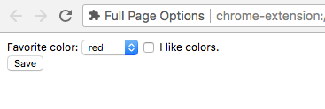
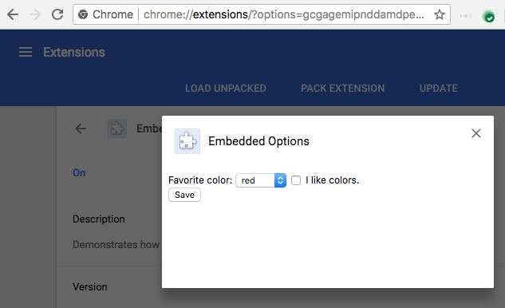

## 给用户选项

 
 
允许用户通过提供选项页面来自定义扩展的行为。 用户可以通过右键单击工具栏中的扩展图标，然后选择选项，或访问 chrome://extensions 的扩展管理页面，找到所需的扩展，点击“详细信息”，然后选择选项链接来查看扩展的选项。

### 编写选项页面

下面是一个选项页面示例。

``` html
<!DOCTYPE html>
<html>
<head><title>My Test Extension Options</title></head>
<body>

Favorite color:
<select id="color">
 <option value="red">red</option>
 <option value="green">green</option>
 <option value="blue">blue</option>
 <option value="yellow">yellow</option>
</select>

<label>
  <input type="checkbox" id="like">
  I like colors.
</label>

<div id="status"></div>
<button id="save">Save</button>

<script src="options.js"></script>
</body>
</html>
```

使用 [storage.sync](https://developer.chrome.com/extensions/storage#property-sync) API 在设备上保存用户的首选项。

``` js
// Saves options to chrome.storage
function save_options() {
  var color = document.getElementById('color').value;
  var likesColor = document.getElementById('like').checked;
  chrome.storage.sync.set({
    favoriteColor: color,
    likesColor: likesColor
  }, function() {
    // Update status to let user know options were saved.
    var status = document.getElementById('status');
    status.textContent = 'Options saved.';
    setTimeout(function() {
      status.textContent = '';
    }, 750);
  });
}

// Restores select box and checkbox state using the preferences
// stored in chrome.storage.
function restore_options() {
  // Use default value color = 'red' and likesColor = true.
  chrome.storage.sync.get({
    favoriteColor: 'red',
    likesColor: true
  }, function(items) {
    document.getElementById('color').value = items.favoriteColor;
    document.getElementById('like').checked = items.likesColor;
  });
}
document.addEventListener('DOMContentLoaded', restore_options);
document.getElementById('save').addEventListener('click',
    save_options);
```

### 声明选项页面行为

扩展选项页面有两种可用的类型：[整页](https://developer.chrome.com/extensions/options#full_page)和[嵌入式](https://developer.chrome.com/extensions/options#embedded_options)。 选项的类型由 minifest 中的声明方式决定。

#### 整页选项

扩展程序的选项页面将显示在新选项卡中。该 Html 文件在 options_page 字段下注册。

```
{
  "name": "My extension",
  ...
  "options_page": "options.html",
  ...
}
```




#### 嵌入式选项

嵌入式选项使用户可以无需离开扩展管理页面就能调整扩展选项。 要声明嵌入式选项，请在扩展 manifest 的 options_ui 字段下注册 HTML文件，并将 open_in_tab 键设置为false。

```
{
  "name": "My extension",
  ...
  "options_ui": {
    "page": "options.html",
    "open_in_tab": false
  },
  ...
}
```



* page (string)
  选项页面的路径，相对于扩展的根目录。
  
* open_in_tab (boolean)

 指定为 false 以声明嵌入式选项页面。如果为true，则扩展的选项页面将在新标签页中打开，而不是嵌入 chrome://extensions 中。
 
### 思考差异
 
嵌入在 chrome://extensions 中的选项页与整页选项页存在一些细微的行为差异。

#### 链接到选项页面

扩展程序可以通过调用chrome.runtime.openOptionsPage() 直接链接到选项页面。

``` html
<button id="go-to-options">Go to options</button>
```

``` js
document.querySelector('#go-to-options').addEventListener(function() {
  if (chrome.runtime.openOptionsPage) {
    chrome.runtime.openOptionsPage();
  } else {
    window.open(chrome.runtime.getURL('options.html'));
  }
});
```

#### Tabs API

扩展程序嵌入的选项页面代码未托管在选项卡中，从而影响了 Tabs API 的使用方式：

* tabs.query 在扩展程序的选项页面 URL 中永远找不到 tab。
* 打开选项页面时，tabs.onCreated 将不会触发。
* 选项页加载状态更改时，tabs.onUpdated 将不会触发。
* tabs.connect 或 tabs.sendMessage 不能用于与选项页面进行通信。

如果选项页面确实需要操纵选项卡，使用 runtime.connect 和 runtime.sendMessage 解决这些限制。

#### Messaging APIs

如果扩展程序的选项页面使用 runtime.connect 或 runtime.sendMessage 发送消息，则不用设置 sender tab，并且 sender url 将是选项页URL。

#### Sizing

嵌入式选项页应根据页面内容自动确定其自身大小。 但是，对于某些类型的内容，嵌入式容器可能找不到合适的尺寸。对于根据窗口大小调整其内容形状的选项页，此问题最常见。

如果这是一个问题，请为选项页面提供固定的最小尺寸，以确保嵌入式页面将找到合适的尺寸。


   

-------

关注 微信公众号「**程序化思维**」 获取最新 Chrome 插件开发教程。


