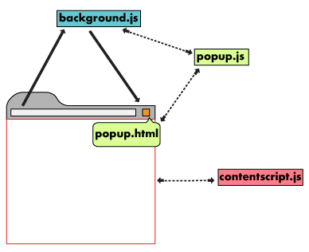

## 总览

扩展程序是 HTML，CSS，JavaScript，图片和其他文件的压缩包，可自定义 Google Chrome 浏览器使用体验。扩展程序是使用 web 技术构建的，可以使用浏览器的开放网络提供的相同 API。

扩展具有广泛的功能可能性。他们可以修改用户看到的 Web 内容并与之交互或扩展和更改浏览器本身的行为。

总的来说扩展是一个网关，使 Chrome 浏览器成为最个性化的浏览器。

### 扩展文件

每个扩展的文件类型和目录数量有所不同，但都必须有 manifest。 一些基本但有用的扩展程序可能仅由 manifest 及其工具栏图标组成。

名为 manifest.json 的文件为浏览器提供了有关扩展的信息，例如最重要的文件和扩展可能使用的功能。

```
{
    "name": "My Extension",
    "version": "2.1",
    "description": "Gets information from Google.",
    "icons": {
      "128": "icon_16.png",
      "128": "icon_32.png",
      "128": "icon_48.png",
      "128": "icon_128.png"
    },
    "background": {
      "persistent": false,
      "scripts": ["background_script.js"]
    },
    "permissions": ["https://*.google.com/", "activeTab"],
    "browser_action": {
      "default_icon": "icon_16.png",
      "default_popup": "popup.html"
    }
  }
```

扩展程序必须在浏览器工具栏中有一个图标。通过工具栏图标可以轻松访问并让用户知道安装了哪些扩展。大多数用户将通过单击图标来与使用弹出窗口的扩展程序进行交互。

#### 指向文件

扩展文件可以通过使用相对 URL 来引用，就像普通 HTML 页面中的文件一样。

``` html
  
```

此外，还可以使用绝对 URL 访问每个文件。

```
chrome-extension://<extensionID>/<pathToFile>
```

在绝对 URL 中，\<extensionID> 是扩展系统为每个扩展生成的唯一标识符。 可以访问 URL chrome://extensions 查看所有已加载扩展名的 ID 。\<pathToFile> 是扩展的顶层文件夹下文件的位置；它根据相对 URL 匹配。

在使用解压缩后的扩展程序时，扩展程序 ID 可能会更改。 具体来说，如果从其他目录加载扩展，则解压缩扩展的 ID 会发生变化；扩展名打包后，ID将再次更改。如果扩展程序的代码依赖于绝对 URL，则可以使用 chrome.runtime.getURL() 方法来避免在开发过程中对 ID 进行硬编码。

### 架构

扩展的架构取决于其功能，但许多健壮的扩展都包括多个组件：

* [Manifest](./manifest.md)
* [后台脚本](./background_content.md)
* [交互界面](./user_interface.md)
* [内容脚本](./content_scripts.md)
* [选项页面](./options.md)

##### 后台脚本

后台脚本是扩展的事件处理程序。它包含对扩展很重要的浏览器事件的监听器。它将处于休眠状态，直到触发事件执行所指示的逻辑为止。有效的后台脚本仅在需要时才加载，而在空闲时则不加载。

##### 交互界面

扩展程序的用户界面应该是有目的且简单的。用户界面应自定义或增强浏览体验，这样不会分散用户注意力。大多数扩展程序有[浏览器操作](https://developer.chrome.com/extensions/browserAction)或[页面操作](https://developer.chrome.com/extensions/pageAction)，但也可以包含其他形式的 UI，例如[上下文菜单](https://developer.chrome.com/contextMenus)，[地址栏](https://developer.chrome.com/extensions/omniBox)或[键盘快捷键](https://developer.chrome.com/extensions/commands)。

扩展的 UI 页面（例如 popup 弹出窗口）可以包含具有 JavaScript 逻辑的普通 HTML。扩展程序还可以调用 tabs.create 或 window.open() 来显示扩展程序的其他 HTML 文件。

用到页面操作和弹出窗口的扩展可以使用 [declarative content](https://developer.chrome.com/extensions/declarativeContent) API 在后台脚本中为用户设置规则。满足条件后，后台脚本会与弹出窗口进行通信，以使用户可点击其图标。


##### 内容脚本

扩展使用内容脚本读取或写入网页。内容脚本包含 JavaScript，该 JavaScript 在已加载到浏览器的页面的上下文中执行。内容脚本读取和修改浏览器访问网页的 DOM 元素。




内容脚本可以使用 storage API 交换消息并存储值来与其父扩展进行通信。


##### 选项页面

就像扩展程序允许用户自定义 Chrome 浏览器一样，选项页面也允许自定义扩展程序。选项可用于启用特性，并允许用户选择与他们的需求相关的功能。

### 使用 Chrome API

扩展程序除了可以访问与网页相同的 API 外，还可以使用特定于扩展程序的API，这些 API 可以与浏览器紧密集成。扩展程序和网页都可以访问标准window.open() 方法来打开 URL，但是扩展程序可以使用 Chrome API tabs.create 方法来指定应在哪个窗口中显示 URL。

##### 同步 vs 异步

大多数 Chrome API 方法都是异步的：它们立即返回无需等待操作完成。如果扩展需要知道异步操作的结果，则可以将回调函数传递给方法。该方法返回后，回调可能会稍后执行，也可能要晚得多。

如扩展程序需要将用户当前选择的标签重定向到新的 URL，则需要获取当前标签的ID，然后将该标签的地址更新为新的 URL。

如果 [tabs.query](https://developer.chrome.com/tabs#method-query) 方法是同步的，则可能如下所示。

``` js
  //THIS CODE DOESN'T WORK
  var tab = chrome.tabs.query({'active': true}); //WRONG!!!
  chrome.tabs.update(tab.id, {url:newUrl});
  someOtherFunction();
```

该方法将失败，因为 query() 是异步的。 它不等待任务完成就会返回，并且不返回值。当回调参数在其签名中存在时，该方法才能够异步调用。

``` js
  // Signature for an asynchronous method
  chrome.tabs.query(object queryInfo, function callback)
```

要正确查询选项卡并更新其 URL，扩展名必须使用 callback 参数。

``` js
  //THIS CODE WORKS
  chrome.tabs.query({'active': true}, function(tabs) {
    chrome.tabs.update(tabs[0].id, {url: newUrl});
  });
  someOtherFunction();
```

在上面的代码中，这些行按以下顺序执行：1、4、2。仅在获得有关当前所选选项卡的信息之后，才调用 query() 的回调函数，然后执行第 2 行。 在 query() 返回之后的某个时间发生。 尽管 update() 也是异步的，但是代码没有使用回调参数，因为扩展对更新结果没做其他事情。

``` js
  // Synchronous methods have no callback option and returns a type of string
  string chrome.runtime.getURL()
```

此方法以字符串形式同步返回 URL，并且不执行其他任何异步工作。

##### 更多细节

有关更多信息，请浏览 [Chrome API](https://developer.chrome.com/extensions/api_index) 参考文档并观看以下视频 [Youtube](https://youtu.be/bmxr75CV36A)。

### 页面之间的通信

扩展中的不同组件通常需要相互通信。通过使用 [chrome.extension](https://developer.chrome.com/extensions/extension) 方法，例如getViews() 和 getBackgroundPage()，不同的 HTML 页面可以找到彼此。 一旦页面引用了其他扩展页面，第一个页面就可以调用其他页面上的函数并操纵其 DOM 元素。 此外，扩展的所有组件都可以访问使用 Storage API 存储值，和通过[消息传递](https://developer.chrome.com/extensions/messaging)进行通信。

### 保存数据和隐身模式

扩展可以使用 Storage API，HTML5 [webstorage API](https://html.spec.whatwg.org/multipage/webstorage.html)或请求保存数据的服务器来保存数据。当扩展程序需要保存某些内容时，请首先考虑它是否来自隐身窗口。默认情况下，扩展程序不会在隐身窗口中运行。

隐身模式保证该窗口不会留下任何痕迹。在使用隐身窗口处理数据时，扩展程序应遵守这一承诺。如果扩展程序可以保存浏览历史记录，请不要保存隐身窗口中的历史记录。但扩展程序可以在任何窗口（无论是否隐身）设置存储首选项。

要检测窗口是否处于隐身模式，请检查相关的 tabs.Tab 或 windows.Window 对象的 incognito 属性。

``` js
function saveTabData(tab) {
  if (tab.incognito) {
    return;
  } else {
    chrome.storage.local.set({data: tab.url});
  }
}
```

### 下一步

阅读概述并完成入门教程之后，开发人员应该准备开始编写自己的扩展！使用以下资源深入了解自定义 Chrome 的世界。

* 在[调试教程](./debugging.md)中了解可用于调试扩展的选项。

* Chrome 扩展程序可以访问功能强大的 API，而这些 API 均超出开放网络所提供的范围。 [chrome.*API文档](https://developer.chrome.com/api_index) 将介绍每个 API。

* [开发人员指南](./devguide.md)还有许多其他链接，这些链接指向与高级扩展创建相关的文档。


-------

关注 微信公众号「**程序化思维**」 获取最新 Chrome 插件开发教程。


