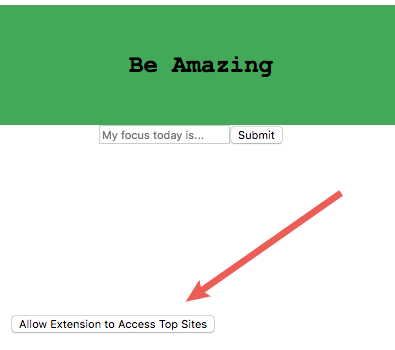
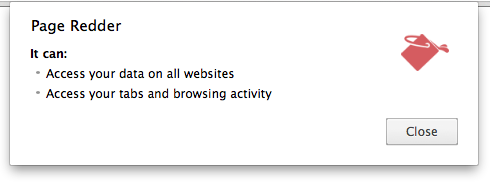
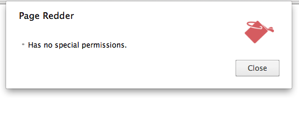
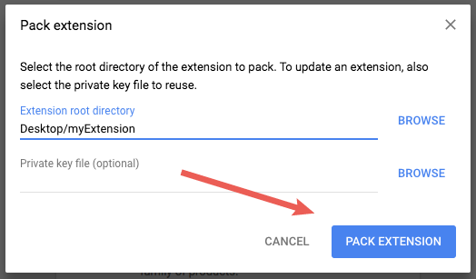
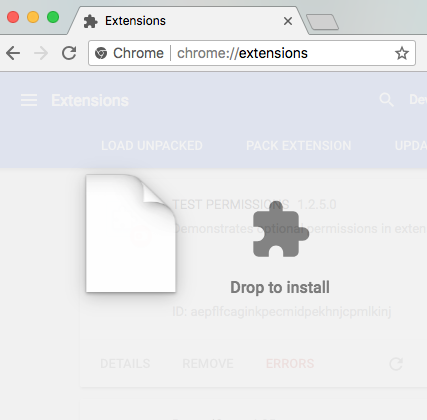
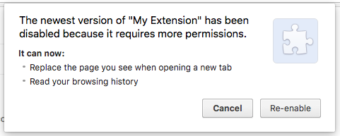
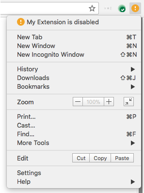
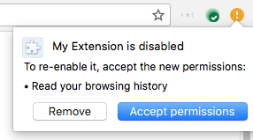

## 声明权限并警告用户

扩展程序访问网站和大多数 Chrome API 的能力取决于其声明的[权限](https://developer.chrome.com/extensions/extensions/declare_permissions)。 权限应仅限于其功能所需。限制权限可以建立扩展程序的功能，并减少攻击者入侵扩展程序导致的数据入侵的可能。通过显式，最小和可选权限来保护扩展及其用户。

### 整理权限

权限是固定已知的字符串，它们引用 Chrome API 或 [match patterns](https://developer.chrome.com/extensions/extensions/match_patterns) 以赋予对一个或多个主机的访问权限。它们在 manifest 中列出，并指定为必需或可选权限。

```
{
    "name": "Permissions Extension",
    ...
    // required permissions
    "permissions": [
      "activeTab",
      "contextMenus",
      "storage"
    ],
    // optional permissions
    "optional_permissions": [
      "topSites",
      "http://www.developer.chrome.com/*"
    ],
        ...
    "manifest_version": 2
  }
```

应将权限限制为扩展核心功能所需权限。扩展不应要求超出当前所需权限；不应要求将来更新可能需要的权限。

可选功能所需的权限应注册为 [optional permissions](https://developer.chrome.com/extensions/permission_warnings#optional_events)。 这使用户可以决定他们是否愿意提供扩展的访问权限来使用可选功能。

### 确定所需的权限

一个简单的扩展可能需要多个权限，并且许多权限在安装时会显示警告。用户更有可能信任带有警告或在向其解释权限的扩展。


确定扩展的核心功能及其所需的权限。如果功能需要警告权限，请考虑将其设为可选。

### 使用事件触发可选权限

[optional permissions sample extension](https://developer.chrome.com/extensions/samples#search:optional) 扩展核心功能是覆盖新的标签页。其中一个功能是显示用户当天的目标。此功能仅需要 [storage](https://developer.chrome.com/extensions/extensions/storage) 许可，不包括警告。



该扩展有其他功能。显示用户的热门网站。此功能需要 [topSites](https://developer.chrome.com/topSites) 权限，并带有警告。


开发依赖于警告（可选）的权限的功能，并合理引入这些功能，可以让用户无风险地入门该扩展。此外，也允许用户使用扩展程序进一步自定义其体验，并为解释警告提供了机会。

### 替换 activeTab 权限

activeTab 权限给予对用户所在站点的临时访问权限，并允许扩展使用当前选项卡上的 "[tabs](https://developer.chrome.com/extensions/tabs)" 权限。在许多情况下，它代替了对 "< all_urls >" 的需要，并且在安装时不显示任何警告。

 

当用户调用扩展时，activeTab 权限将给予对当前活动选项卡的临时访问权限。如果扩展遭到破坏，攻击者将需要等待用户调用该扩展才能获得访问权限，并且该访问权限持续到浏览到别的页面或关闭选项卡为止。

为选项卡启用 activeTab 权限后，扩展程序可以：

* 在该选项卡上调用 [tabs.executeScript](https://developer.chrome.com/extensions/tabs#method-executeScript) 或 [tabs.insertCSS](https://developer.chrome.com/extensions/tabs#method-insertCSS)。
* 通过返回 [tabs.Tab](https://developer.chrome.com/extensions/tabs#type-Tab) 对象的 API 获取该选项卡的 URL，标题和图标。
* 使用 [webRequest](https://developer.chrome.com/extensions/webRequest) API 将标签中的网络请求拦截到标签的主框架 origin。该扩展名暂时获得该选项卡的主框架 origin 的主机权限。 

以下用户场景可启用 activeTab ：

* 执行 [browser action](https://developer.chrome.com/extensions/browserAction)
* 执行 [page action](https://developer.chrome.com/extensions/pageAction)
* 执行 [context menu item](https://developer.chrome.com/extensions/contextMenus)
* 从 [ commonds API](https://developer.chrome.com/extensions/commands) 执行键盘快捷键
* 接受来自 [地址栏 API](https://developer.chrome.com/extensions/omnibox) 的建议

### 允许访问

如果扩展程序需要访问 file://URL 或以隐身模式运行，则用户需要在 chrome://extensions 的扩展程序详细信息页面内启用对这些功能的访问。


扩展可以通过调用 [extension.isAllowedIncognitoAccess()](https://developer.chrome.com/extensions/extension#method-isAllowedIncognitoAccess) 检测它是否以隐身模式启用。或在 file://URL 上调用 [extension.isAllowedFileSchemeAccess()](https://developer.chrome.com/extensions/extension#method-isAllowedFileSchemeAccess) 检测是否可启用。


### 了解权限

权限警告会出现在描述 API 授予扩展一些用户功能的时候，但其中一些警告一开始可能并不明显。 例如，添加 [tabs](https://developer.chrome.com/tabs) 权限会导致看似无关的警告：扩展程序可读取您的浏览活动。尽管 chrome.tabs API 可能仅用于打开新标签页，但也可以使用它的 tabs.Tab 对象来查看与每个新打开的标签页关联的 URL。

如果可能，请用可选权限或功能较弱的 API，以避免发出警告。

### 查看警告

如果将扩展作为解压缩文件加载，则不会显示任何权限警告。要查看扩展的权限警告，请访问 chrome://extensions ，并确保启用了开发人员模式，然后点击打包扩展程序。

在扩展程序根目录字段中指定扩展程序文件夹的路径，然后点击打包扩展程序按钮。忽略首次打包的私钥字段。


Chrome 将创建两个文件，.crx文件和 .pem 文件（包含扩展程序的私钥）。


不要丢失私钥！将 .pem 文件保存在秘密安全的地方；更新扩展的时候用的上。

将 .crx文 件放入 Chrome 扩展程序的“管理”页面，以进行安装。**(译者注：新版 Chrome 对于未在商店发布的扩展没法直接拖拽安装，可将后缀 .crx 替换成 .zip 后再拖拽安装)**



拖拽 .crx 文件后，浏览器将询问是否可以添加扩展并显示警告。


### 有警告的权限

注意：权限表会一直更新，可能与当前警告略有差异。此外，某些权限与其他权限匹配时可能不会显示警告。例如，如果扩展要 “< all_urls >” 权限，则不会显示tabs 警告。要验证扩展权限的最新警告，请按照查看警告中的步骤进行操作。

| Permission | Description | Warning |
| --- | --- | --- |
|  "http://\*/\*" "https://\*/\*" "\*\:\/\/\*/\*" “< all_urls >" |  授权扩展访问所有主机的权限。通过使用activeTab 权限，可以避免声明所有主机权限。| 阅读和更改您访问的网站上的所有数据 |
| "https://HostName.com/" | 授权扩展访问“https://HostName.com/” 的权限。通过使用 activeTab 权限，可以避免声明所有主机权限。 |  在HostName.com上读取和更改您的数据 |
| "bookmarks" |授权您的扩展程序对chrome.bookmarks API的访问权限。 |  阅读和更改您的书签 |
| "clipboardRead" |  如果扩展使用document.execCommand（'paste'），则为必需的权限。 |  读取您复制和粘贴的数据 |
| "clipboardWrite" |  显示扩展使用document.execCommand（'copy'）或document.execCommand（'cut'）。 |  修改您复制和粘贴的数据 |
| "contentSettings" |  授权您的扩展程序对chrome.contentSettings API 的访问权限。 |  更改您的设置，以控制网站对Cookie，JavaScript，插件，地理位置，麦克风，摄像头等功能的访问。 |
| "debugger" |  授权您的扩展程序对 chrome.debugger API 的访问权限。|  1.访问页面调试器后端 2.阅读和更改您访问的网站上的所有数据 |
| "declarativeNetRequest" |  授权您的扩展程序对chrome.declarativeNetRequest API的访问权限。| 拦截页面内容 |
| "desktopCapture"| 授权您的扩展程序对 chrome.desktopCapture API 的访问权限。 | 捕捉屏幕内容 |
| "downloads"| 授权您的扩展程序对 chrome.downloads API的访问权限。 | 管理您的下载 |
| "geolocation"| 允许扩展程序使用 HTML5 geolocation API，而无需提示用户许可。 | 检测您的实际位置 |
| "history" | 授权您的扩展程序对 chrome.history API 的访问权限 | 阅读并更改您的浏览历史记录 |
| "management" | 授权扩展访问 chrome.management API的权限。 | 管理您的应用，扩展程序和主题 |
| "nativeMessaging" | 授权扩展访问 native messaging API 的权限。 | 与本机应用程序进行通信 |
| "notifications" | 授权您的扩展程序对chrome.notifications API的访问权限。 |显示通知  |
| "pageCapture" | 授权扩展访问 chrome.pageCapture API的权限 |  访问和更改您访问的网站上的所有数据|
|"privacy" | 授权扩展访问chrome.privacy API的权限。 |更改与隐私相关的设置|
|"proxy"  | 授权扩展访问chrome.proxy API的权限。 |访问和更改您访问的网站上的所有数据|
|"system.storage"| 授权扩展访问 chrome.system.storage API的权限。  | 识别并弹出存储设备 |
| "tabCapture"	 |授权扩展访问 chrome.tabCapture API 的权限。| 访问和更改您访问的网站上的所有数据|
| "tabs" | 授权扩展访问 Tab 的权限，该 Tab 由多个 API 使用，包括chrome.tabs 和 chrome.windows。在许多情况下，扩展无需声明 “Tabs” 权限即可使用这些 API。| 访问浏览记录 |
|"topSites"| 授权扩展访问 chrome.topSites API 的权限。 | 访问您最常访问的网站的列表 |
| "ttsEngine" | 授权扩展访问 chrome.ttsEngine API 的权限。 | 服务使用合成语音朗读的所有文字 |
| "webNavigation" | 授权扩展访问 chrome.webNavigation API 的权限。 |访问浏览记录|


### 更新权限

扩展更新，需要其他权限时，可能会暂时被禁用。用户在同意新警告后，才能重新启用它。

如果用户手动更新现在包含 "tabs" 权限的扩展，他们将在管理页面上收到警告。



如果扩展是自动更新的，它将被禁用，直到用户同意新的权限。





可以通过将新功能设置为可选功能并将新的权限更新添加到 manifest 中的optional_permissions 来避免这种情况。


-------

关注 微信公众号「**程序化思维**」 获取最新 Chrome 插件开发教程。


