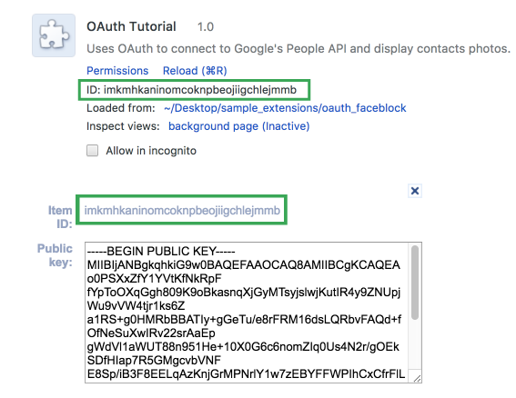
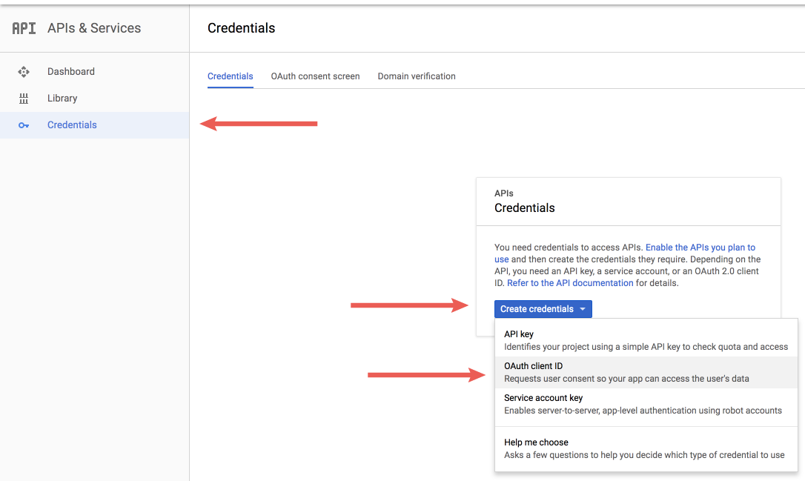
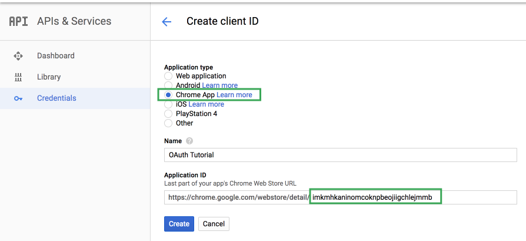
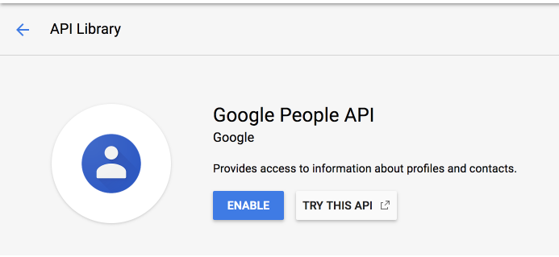
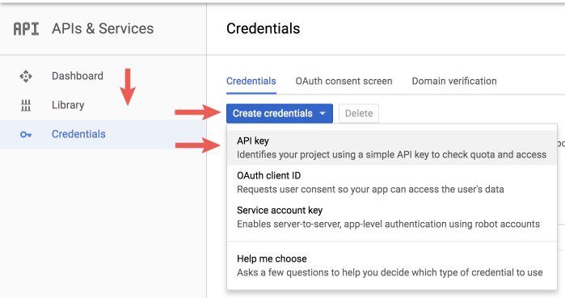
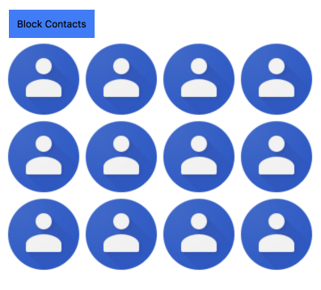

## OAuth2

#### 通过 Google 对用户进行身份验证
[OAuth2](https://oauth.net/2/) 是用于授权的行业标准协议。它提供了一种机制，使用户可以在不共享用户名，密码和其他私有凭据的情况下，向Web 和桌面应用程序授予对私有信息的访问权限。

本教程构建了一个扩展程序，该扩展程序使用[Google People API](https://developers.google.com/people/) 和[Chrome Identity API](https://developer.chrome.com/identity) 访问用户的 Google 联系人。由于扩展程序无法通过 HTTPS加载，无法执行重定向或设置 Cookie，因此它们依赖于 Chrome identity API 来使用OAuth2。

### 开始使用

首先创建目录和以下启动文件。

完整的扩展程序可以在[此处](https://developer.chrome.com/extensions/examples/tutorials/oauth_tutorial_complete.zip)下载。

#### manifest.json
创建一个名为 manifest.json 的文件，并包含以下代码。

```
{
    "name": "OAuth Tutorial FriendBlock",
    "version": "1.0",
    "description": "Uses OAuth to connect to Google's People API and display contacts photos.",
    "manifest_version": 2,
    "browser_action": {
      "default_title": "FriendBlock, friends face's in a block."
    },
    "background": {
      "scripts": [
        "background.js"
      ],
      "persistent": false
    }
  }
```

#### background.js

创建一个名为 background.js 的文件，并包含以下代码。

``` js
chrome.browserAction.onClicked.addListener(function() {
    chrome.tabs.create({url: 'index.html'});
  });
```

#### index.html

创建一个名为 index.html 的文件，并包含以下代码。

``` html
 <html>
    <head>
      <title>FriendBlock</title>
      <style>
        button {
          padding: 10px;
          background-color: #3C79F8;
          display: inline-block;
        }
      </style>
    </head>
    <body>
      <button>FriendBlock Contacts</button>
      <div id="friendDiv"></div>
    </body>
  </html>
```

### 上传到开发者管理后台

将扩展程序目录打包为 .zip 文件，然后将其上传到 [Chrome 开发者管理后台](https://chrome.google.com/webstore/developer/dashboard)，而不发布该文件：

1. 在“开发者管理后台”上，单击“添加新项目”。
2. 单击选择文件，然后选择 .zip 扩展目录并上传。
3. 在不填写其他字段的情况下，选择 “保存草稿” 并返回到仪表盘。

在您的列表下找到扩展名，然后单击更多信息。 从弹出窗口中复制公钥，并将其添加到未压缩目录内 manifest 的 “key”字段下。

```
 {
    "name": "OAuth Tutorial FaceBlcok",
  ...
    "key": "ThisKeyIsGoingToBeVeryLong/go8GGC2u3UD9WI3MkmBgyiDPP2OreImEQhPvwpliioUMJmERZK3zPAx72z8MDvGp7Fx7ZlzuZpL4yyp4zXBI+MUhFGoqEh32oYnm4qkS4JpjWva5Ktn4YpAWxd4pSCVs8I4MZms20+yx5OlnlmWQEwQiiIwPPwG1e1jRw0Ak5duPpE3uysVGZXkGhC5FyOFM+oVXwc1kMqrrKnQiMJ3lgh59LjkX4z1cDNX3MomyUMJ+I+DaWC2VdHggB74BNANSd+zkPQeNKg3o7FetlDJya1bk8ofdNBARxHFMBtMXu/ONfCT3Q2kCY9gZDRktmNRiHG/1cXhkIcN1RWrbsCkwIDAQAB"
  }
```

### 比较ID

在 chrome://extensions 上打开 “扩展管理” 页面，确保启用了开发人员模式并上传未打包的扩展目录。将扩展管理页面上的扩展 ID 与开发者管理后台中的项目 ID 进行比较。他们应该匹配。



该扩展通过在 manifest 中包含 “key” 字段来保持相同的ID。保留单个ID 对于 API 注册至关重要。


### 创建 OAuth 客户端ID

访问 [Google API](https://console.developers.google.com/apis) 控制台并创建一个新项目。准备就绪后，在边栏中选择“Credentials”，单击“Create credentials”，然后选择 “OAuth client ID”。



在创建客户端ID页面上，选择 Chrome App。填写扩展名，并将扩展 ID 放在 URL 的末尾的 “Application ID” 字段中。



单击创建完成。控制台将提供 OAuth客户端ID。

### 在 manifest 中注册 OAuth

在 manifest 中增加 “oauth2” 字段。将生成的OAuth Application ID 放在 “client_id”下。现在，在“scopes” 中包含一个空字符串。

```
{
  "name": "OAuth Tutorial FriendBlock",
  ...
  "oauth2": {
    "client_id": "yourExtensionOAuthClientIDWillGoHere.apps.googleusercontent.com",
    "scopes":[""]
  },
  ...
}
```

### 启动第一个OAuth流程 

注册 [identity](https://developer.chrome.com/identity) 权限

```
{
    "name": "OAuth Tutorial FaceBlcok",
    ...
    "permissions": [
      "identity"
    ],
    ...
  }
```

创建一个名为 oauth.js 的文件来管理 OAuth流，并包含以下代码。

```js
  window.onload = function() {
    document.querySelector('button').addEventListener('click', function() {
      chrome.identity.getAuthToken({interactive: true}, function(token) {
        console.log(token);
      });
    });
  };
```

将 oauth.js 的 script 标签放在 index.html 的 head 里。

``` html
  ...
    <head>
      <title>FriendBlock</title>
      ...
      <script type="text/javascript" src="oauth.js"></script>
    </head>
  ...

```

重新加载扩展，然后单击浏览器图标以打开index.html。 打开控制台，然后单击“FriendBlock Contacts” 按钮。 OAuth令牌将出现在控制台中。


### 启用 Google People API

返回 Google API 控制台，然后从边栏中选择Library。 搜索 “Google People API”，单击正确的结果并启用它。



将 Google People API 客户端库添加到扩展 manifest 中的 “scopes” 字段里。

```
{
  "name": "OAuth Tutorial FaceBlcok",
  ...
  "oauth2": {
    "client_id": "yourExtensionOAuthClientIDWillGoHere.apps.googleusercontent.com",
    "scopes": [
      "https://www.googleapis.com/auth/contacts.readonly"
    ]
  },
  ...
}
```

返回 Google API 控制台的 credentials。 单击“Create credentials”，然后从下拉列表中选择 “API key”。



保留生成的 API 密钥以供以后使用。

### 创建第一个API请求

现在，该扩展程序已具有适当的权限和凭证，并且可以授权 Google 用户，它可以通过 People API 请求数据。 更新 oauth.js 中的代码以使其与下面的代码匹配。

``` js
window.onload = function() {
    document.querySelector('button').addEventListener('click', function() {
      chrome.identity.getAuthToken({interactive: true}, function(token) {
        let init = {
          method: 'GET',
          async: true,
          headers: {
            Authorization: 'Bearer ' + token,
            'Content-Type': 'application/json'
          },
          'contentType': 'json'
        };
        fetch(
            'https://people.googleapis.com/v1/contactGroups/all?maxMembers=20&key=<API_Key_Here>',
            init)
            .then((response) => response.json())
            .then(function(data) {
              console.log(data)
            });
      });
    });
  };
```

将 < API_Key_Here > 替换为从 Google API 控制台生成的 API 密钥。该扩展应该记录一个JSON 对象，memberResourceNames 字段下包含一个 people/account_ids 数组。


现在，扩展程序返回用户的联系人列表，它可以发出其他请求来检索这些联系人的个人资料和信息。 该扩展将使用 memberResourceNames 来检索用户联系人的照片信息。更新 oauth.js 以包含以下代码。

``` js
 window.onload = function() {
    document.querySelector('button').addEventListener('click', function() {
      chrome.identity.getAuthToken({interactive: true}, function(token) {
        let init = {
          method: 'GET',
          async: true,
          headers: {
            Authorization: 'Bearer ' + token,
            'Content-Type': 'application/json'
          },
          'contentType': 'json'
        };
        fetch(
            'https://people.googleapis.com/v1/contactGroups/all?maxMembers=20&key=<API_Key_Here>',
            init)
            .then((response) => response.json())
            .then(function(data) {
              let photoDiv = document.querySelector('#friendDiv');
              let returnedContacts = data.memberResourceNames;
              for (let i = 0; i < returnedContacts.length; i++) {
                fetch(
                    'https://people.googleapis.com/v1/' + returnedContacts[i] +
                        '?personFields=photos&key=<API_Key_Here>',
                    init)
                    .then((response) => response.json())
                    .then(function(data) {
                      let profileImg = document.createElement('img');
                      profileImg.src = data.photos[0].url;
                      photoDiv.appendChild(profileImg);
                    });
              };
            });
      });
    });
  };
```

重新加载并返回扩展。 单击 FriendBlock 按钮！ 尽情享受联络人的头像。




-------

关注 微信公众号「**程序化思维**」 获取最新 Chrome 插件开发教程。


