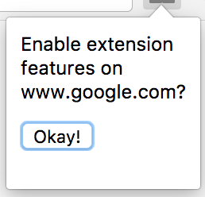
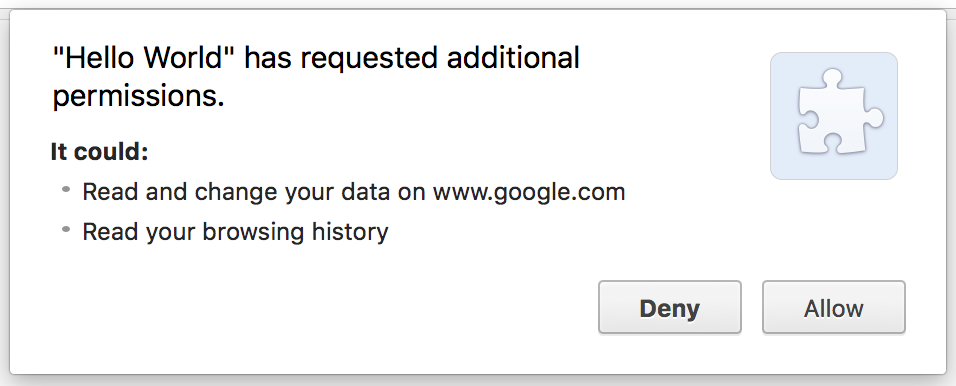

## 保护用户隐私

如果扩展程序损害了他们的隐私或要求提供需要的更多权限，则用户将不会安装该扩展程序。权限请求应对用户有意义，并且限于实现扩展所需的关键信息。 收集或传输任何用户数据的扩展必须遵守[用户数据隐私策略](https://developer.chrome.com/webstore/program_policies#userdata)。

通过包括以下预防措施来保护和尊重用户，以确保其身份安全。切记：扩展可以访问的数据越少，意外泄漏的数据就越少。

### 减少所需的权限

扩展可以访问的 API 在 manifest 的权限字段中指定。赋予的权限越多，攻击者拦截信息的途径就越多。 仅列出扩展所依赖的 API，并应考虑侵入性较小的选项。扩展程序请求的权限越少，向用户显示的权限警告就越少。用户更有可能安装带有有限警告的扩展程序。

扩展不应通过请求用户当前不需要但将来可能会实现的权限来 “未来证明” 对用户数据的访问。在扩展更新中包含新权限，并考虑将其设为可选。

#### activeTab

使用 host 权限注入脚本的扩展通常可以被 activeTab 代替。仅当用户调用扩展时，activeTab 权限才会授权扩展对当前活动选项卡的临时访问权限。当用户离开或关闭当前选项卡时，访问被切断。 它是 < all_urls > 的许多用途的替代方法。

```
{
    "name": "Very Secure Extension",
    "version": "1.0",
    "description": "Example of a Secure Extension",
    "permissions": ["activeTab"],
    "manifest_version": 2
  }
```

在安装过程中，activeTab 权限不显示任何警告消息。

### 选择可选权限

通过包含可选权限，使用户能够从扩展中选择所需的功能和权限。如果某个功能对于扩展程序的核心功能不是必需的，请将其设为可选，然后将 API 或域名移至 optional_permissions 字段中。

```
 {
    "name": "Very Secure Extension",
    ...
    "optional_permissions": [ "tabs", "https://www.google.com/" ],
    ...
  }
```

可选权限可以使扩展向用户解释启用相关功能时为何需要特定权限。该扩展可以为用户提供启用功能的选项。



单击确定！将在后台脚本中触发以下事件。

``` js
document.querySelector('#button').addEventListener('click', function(event) {
    // Permissions must be requested from inside a user gesture, like a button's
    // click handler.
    chrome.permissions.request({
      permissions: ['tabs'],
      origins: ['https://www.google.com/']
    }, function(granted) {
      // The callback argument will be true if the user granted the permissions.
      if (granted) {
        // doSomething();
      } else {
        // doSomethingElse();
      }
    });
  });
```

然后，将向用户提示以下请求。




也可以在扩展更新中实现。 这样做将使用户可以使用该新功能，而无需禁用该扩展，如果使用新的所需权限进行更新，可能会发生这种禁用的情况。

### 限制和加密用户信息

仅请求扩展所需的最少用户数据。扩展程序向用户询问的信息越少，意味着扩展程序受到威胁时所面临的风险就越小。

所有请求的用户数据都应谨慎对待。在具有注册域的安全服务器中存储和检索数据。始终使用 HTTPS 进行连接，并避免将敏感的用户数据保留在扩展的客户端中，因为扩展存储未加密。


-------


